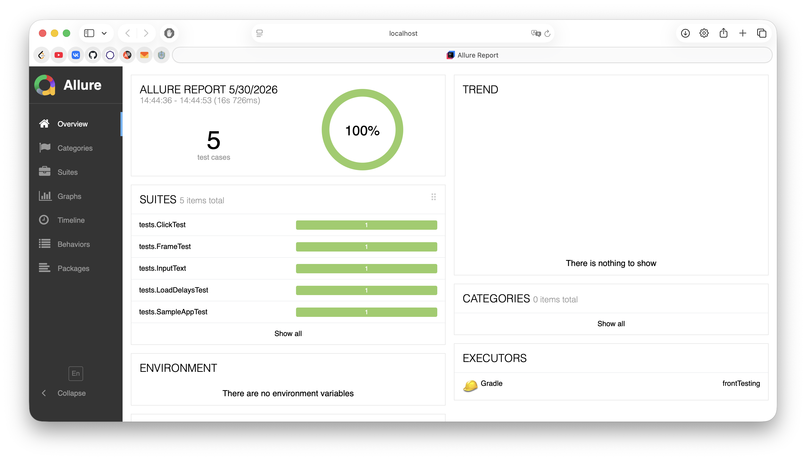

## Запуск проекта

1. **Клонирование репозитория:**
   ```bash
   git clone https://github.com/DmitryTamlin7/frontTesting
   cd frontTesting
   
   ./gradlew test
   ./gradlew allureReport
 
### Отчет будет доступен по пути: build/reports/allure-report/index.html

<p align="center">
  
  <br>
  <i>Рисунок 1. Отчет в Allure.</i>
</p>
